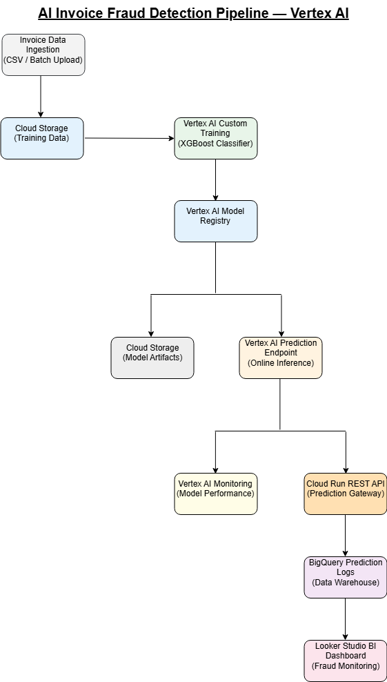

# AI-Powered Invoice Fraud Detection System (Vertex AI)

## 🚀 Overview

Production-grade cloud machine learning system for detecting fraudulent invoices using **Google Vertex AI** and **XGBoost**.

This project simulates a real-world financial fraud detection pipeline with automated training, scalable inference and business analytics monitoring.

The platform provides:

- Real-time fraud risk classification
- Automated cloud deployment
- Business intelligence dashboard
- Transaction monitoring pipeline

---

## 🏗 System Architecture

Pipeline components:

- Google Cloud Storage (Data ingestion)
- Vertex AI Custom Training (XGBoost)
- Vertex AI Model Registry
- Vertex AI Endpoint (Online prediction)
- Cloud Run API (Serving layer)
- BigQuery (Prediction logging)
- Looker Studio (Analytics dashboard)

The system follows a production-grade ML architecture including:
custom training, model lifecycle management, managed inference endpoint,
monitoring layer and business intelligence integration.

---

## 📊 Dashboard Results

### Risk Classification Distribution

- Low Risk: ~88%
- Medium Risk: ~11%
- High Risk: ~0.3%

Dashboard provides live monitoring of fraud exposure and transaction trends.

---

### Weekly Transaction Monitoring

System tracks daily transaction volume and identifies peak fraud-risk periods during the week.

---

## ⚙ Machine Learning Stack

- Model: XGBoost Classifier
- Class imbalance handling: scale_pos_weight
- Feature examples:
  - invoice_amount
  - vendor_country
  - payment_delay_days
  - duplicate invoice flags
  - behavioral anomaly indicators

---

## ☁ Cloud Infrastructure

Training and deployment executed fully on Google Vertex AI:

- Custom training job
- Managed endpoint deployment
- BigQuery integration
- Looker Studio reporting

---

## 🎯 Business Value

- Early fraud detection
- Reduced financial risk
- Automated compliance reporting
- Real-time monitoring

---

## 🔮 Future Improvements

- SHAP explainability
- Automated retraining pipeline
- Streaming ingestion (Pub/Sub)
- Fraud alert notifications

---

## 👤 Author

Charis Kiritsis  
Machine Learning Engineer | Cloud AI Systems
